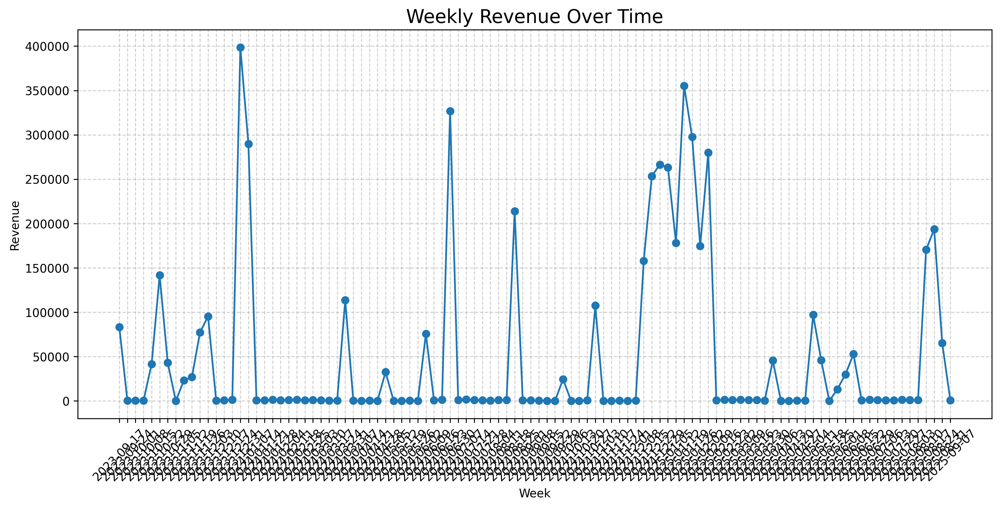
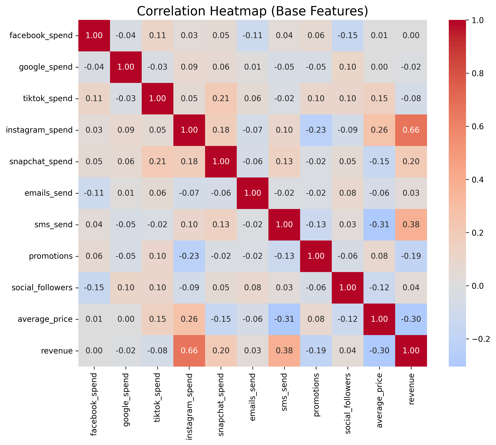
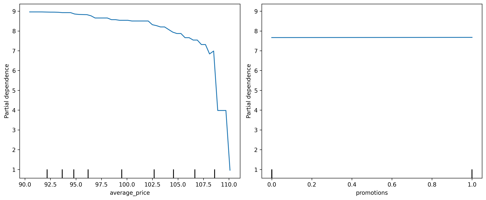
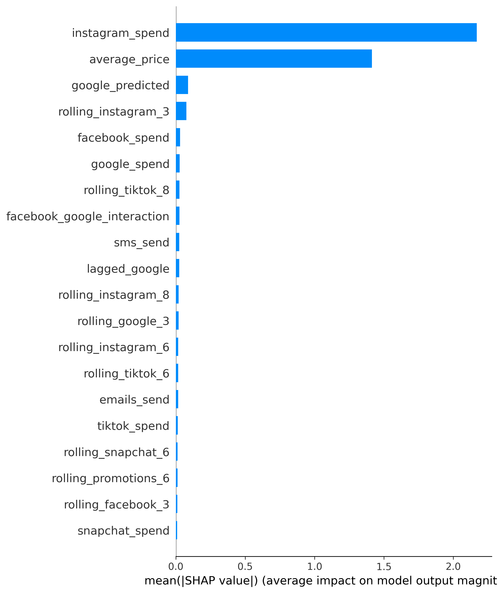
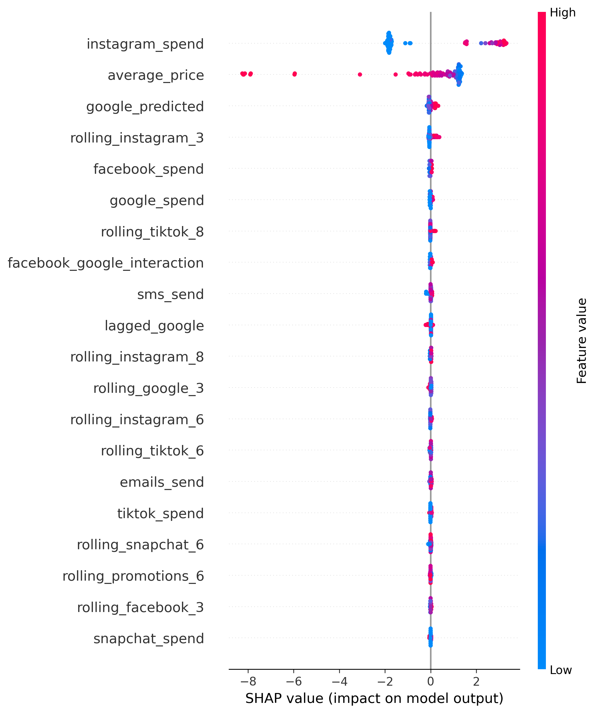
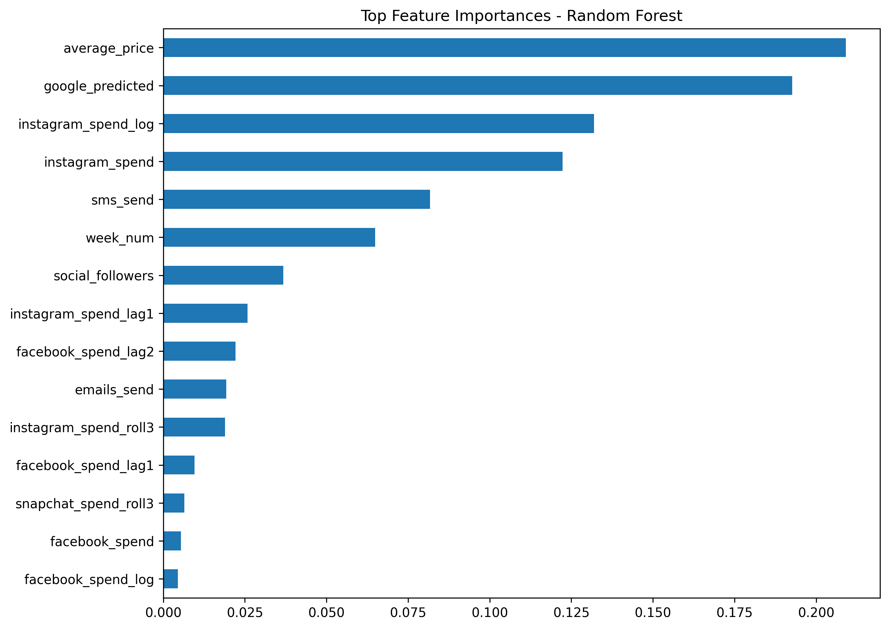

# Weekly Revenue Prediction Project

## Overview
This project predicts weekly revenue using historical marketing and sales data.  
It uses feature engineering (lags, rolling averages, seasonality), mediators (Google spend), and machine learning (XGBoost and Random Forest) to model revenue drivers.

---

## Dataset
- CSV file: `Assessment 2 - MMM Weekly.csv`
- Columns include:
  - `revenue`, `week`  
  - Media spend: `facebook_spend`, `google_spend`, `tiktok_spend`, `instagram_spend`, `snapchat_spend`  
  - Marketing activities: `emails_send`, `sms_send`, `promotions`  
  - Social and other features: `social_followers`, `average_price`  
  - Engineered features: lagged values, rolling averages, interaction terms
- Target: `revenue` (log-transformed in modeling)

---

## Feature Engineering
- **Lagged features**: 1- and 2-week lags for spend and promotions  
- **Rolling averages**: 3-week rolling averages for media spend  
- **Seasonality**: week number and month  
- **Scaling**: numeric features standardized for model stability

---

## Data Exploration

### Weekly Revenue Over Time
Visualizing revenue trends week by week:



### Correlation Heatmap (Base Features)
Shows correlations among key features and revenue:



---

## Modeling

- **Models**:
  - XGBoost Regressor (`reg:squarederror`)  
  - Random Forest Regressor
- **Validation**:
  - 5-fold `TimeSeriesSplit` and K-Fold cross-validation  
- **Hyperparameter tuning**:
  - `RandomizedSearchCV` for XGBoost  
  - Random Forest with tuned `n_estimators` and `max_depth`
- **Metrics**: R² and Mean Squared Error (MSE)

---

## Model Diagnostics

### Partial Dependence Plot (XGBoost)
Shows how `average_price` and `promotions` affect predicted revenue:



### SHAP Summary Plots (XGBoost)
Feature importance and effect distribution:

#### Bar Plot


#### Beeswarm Plot


### Random Forest Top Feature Importances
Shows the top 15 features based on mean importance across folds:



---

## Insights & Recommendations
- **Top revenue drivers**: `average_price`, `promotions`, lagged revenue, social/email campaigns  
- **Effect trends**:
  - Promotions generally increase revenue  
  - Higher prices may decrease revenue  
- **Risks**:
  - Collinearity among features  
  - Mediated effects via Google spend  
  - Seasonality not fully captured  
- **Recommendations**:
  - Optimize marketing spend and pricing while monitoring interactions  
  - Use model for scenario analysis (simulate changes in promotions or price)

---

## How to Run
1. Clone the repo  
2. Install dependencies:  
   ```bash
   pip install -r requirements.txt
